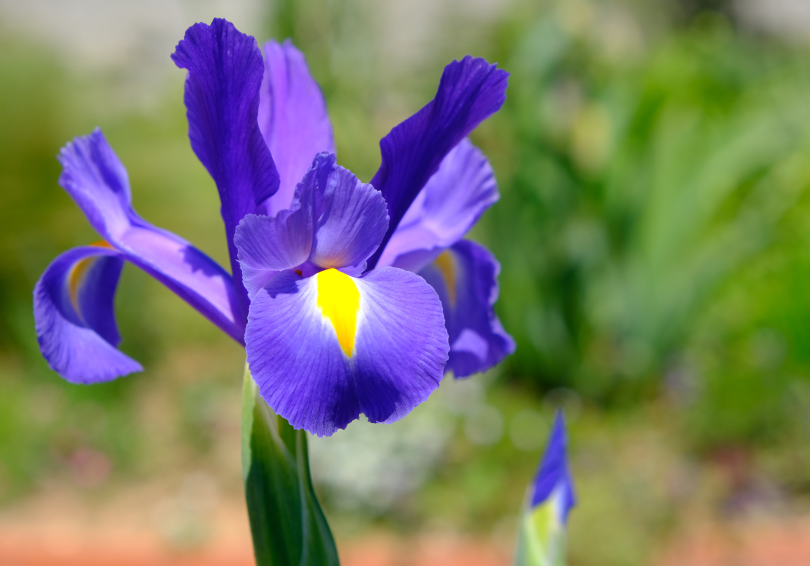

# Iris Linear Regression

Simple Linear Regression project using a sample an Iris Dataset and Scikit-Learn

"Irises are usually purple flowers that bloom between May to June. They attract butterflies and hummingbirds and are lovely additions to gardens."